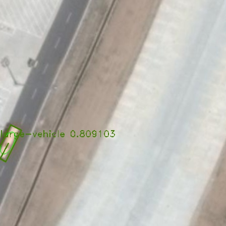
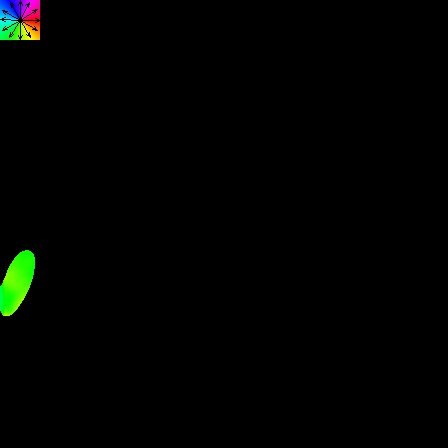

# Object Detection by Ellipse Field

- GitField-09 is the folder with main code to call our field detection, compile successfully in VS2013

- 224x224 is a folder contains the darknet model(.cfg&.weights) and part of test data set.
  
- Field_maps is folder containing detection result demonstration, which overlap objects on original image, and other middle results, such as center field, binary field(or edge field), and direction field.

- Since our smallest weight file is 73M, and the uploading file size is limited in github by 50M, so if you are interesting in this project, please communicat with author by 41038331@qq.com

